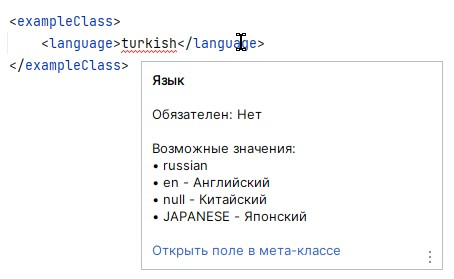

# LiquibaseHelper
___
### Функционал

- Прямая навигация (от кумулятива к ченджсетам) — Ctrl+ЛКМ по пути к файлу
- Обратная навигация (от ченджсетов к кумулятиву) — нажатием на панель сверху редактора
- Подсветка несуществующих файлов в кумулятивах и ченджсетах
- Оповещение о том, что файл не загружается в ченджсете или кумулятиве
- Валидация XML-кода (метаданных)
- Документация при наведении на XML-теги
- Подсказки для автозаполнения тегов внутри родительских

Дополнительные функции:
- Для воркеров: проверка наличия ключей, получаемых или добавляемых в ProcessVariables, в методе 'defineVariables'

### Настройки
Основные настройки плагина можно найти в общем меню настроек IDEA (Ctrl + Alt + S) → раздел **LiquibaseHelper**.

Эти настройки общие для всех проектов, открытых в IntelliJ IDEA.

### Действия
Во время работы плагина можно быстро запускать некоторые действия.
Чтобы открыть меню с действиями, откройте контекстное меню → Tools →  LiquibaseHelper...

Сейчас доступны следующие действия:
- `Перезагрузить правила` 
- `Настройки плагина...` - открыть общие настройки (Ctrl + Alt + S)

В разработке:
- `Дерево ченджсетов...` - позволяет просматривать liquibase-файлы в порядке от кумулятива к самым нижним ченджсетам, в виде дерева
- `Найти ошибки в проекте...` - позволяет просматривать все ошибки по функционалу плагина, найденные в текущем проекте 
- `Генератор метаданных...` - позволяет создавать код мета-файлов, заполняя значения в удобном виде (работает на основе аннотаций `@CbsDatamodelClass` и `@CbsDatamodelField`)


[//]: # (### Жизненный цикл плагина)

[//]: # (На все проекты, открытые через IntelliJ IDEA работает единственный экземпляр плагина. )

[//]: # (Настройки, указанные в общем меню &#40;Ctrl + Alt + S&#41; работают для всех проектов одновременно.)

---

## Валидация XML-кода
При открытии каждого проекта, плагин сканирует все Java-файлы, находящиеся в проекте **metaloader**,
и собирает правила у классов, отмеченных `@CbsDatamodelClass`, с полей, отмеченных `@CbsDatamodelField`.

При любом изменении класса, отмеченного `@CbsDatamodelClass`, правила для этого класса (тега) собираются заново,
что поддерживает правила всегда в актуальном состоянии.

### @CbsDatamodelClass
Аннотация используется для обозначения класса, в котором находятся поля, соответствующие тегам в XML-файлах.
Такие классы называются мета-сущностями или мета-классами.

Когда плагин загружает правила из класса, отмеченного `@CbsDatamodelClass`, правила загружаются не только из этого
класса, но и рекурсивно из всех его родителей, пока не будет достигнут класс `Object` или класс, не подходящий по критериям
(не имеющий аннотацию `@CbsDatamodelClass` или имеющий ошибки [см. пункт Ограничения]).
При этом правила из наследников считаются более приоритетными (если поле в дочернем классе по названию
совпадает с полем из родительского класса, то будут использованы правила поля из дочернего класса).

<details>
<summary>Параметры аннотации</summary>

1. `tag` - название XML-тега, для которого будут работать правила, описанные полями внутри этого класса. 
Если тег не указан явно, то будет сгенерирован автоматически и будет равен названию класса с маленькой буквы 
(например, у класса AccIntentionMeta будет тег accIntentionMeta).
2. `mapped` - признак того, что правила данного класса являются только вложенными. 
Для mapped классов не создается отдельных правил. Правила такого класса только встраиваются в классы-наследники.
Если у такого класса нет ни одного наследника, то его правила никогда не будут использованы.
3. `comment` - комментарий, который показывается при наведении на XML-тег в самой верхней строчке. 
Обычно используется под наименование мета-сущности.
4. `description` - описание, которое отображается под комментарием.

</details>

<details>
<summary>Ограничения</summary>

1. Можно устанавливать только на обычных классах (нельзя на внутренних, вложенных, локальных, анонимных классах, интерфейсах и перечислениях).
2. Название класса должно совпадать с названием файла.
3. Параметр `tag` не должен повторять теги других классов (в том числе неявно созданные теги).
4. Параметр `tag` нельзя применять вместе с `mapped=true`. 
Вложенные (mapped) классы только встраивают свои правила внутрь дочерних классов, поэтому таким классам не нужен тег.
</details>

### @CbsDatamodelField
Аннотация используется для обозначения поля, которое соответствует вложенному XML-тегу. 
В аннотации задаются правила (ограничения), при несоблюдении которых на теге будут выведены ошибки.

<details>
<summary>Ограничивающие параметры (правила)</summary>

1. `required` - является ли заполнение тега обязательным. Если тег не указан или его значение не заполнено, то будет выведена ошибка.
2. `maxLength` - максимальная длина значения тега.
3. `type` - тип данных тега. Поддерживаются следующие типы: 
   1. String (значение тега никак не проверяется);
   2. Long (проверяется парсингом целого числа из значения тега);
   3. Double (проверяется парсингом числа с плавающей точкой);
   4. Boolean (значение тега может быть только 0 или 1);
   5. Date (значение может быть только датой определенных форматов).
4. `availableValues` - возможные значения тега. Заполняется в виде строки или массива строк.
5. `availableValuesEnum` - возможные значения тега. Заполняется в виде ссылки на класс-перечисление (enum).
6. `availableValuesEnumPath` - возможные значения тега. Заполняется в виде полного имени до класса-перечисления (enum).

</details>

<details>
<summary>Информационные параметры</summary>

1. В отличие от `@CbsDatamodelClass`, у этой аннотации нет параметра `tag` — название XML-тега должно полностью совпадать с названием поля класса.
2. `comment` - комментарий, который показывается при наведении на XML-тег в самой верхней строчке.
Обычно используется под наименование мета-сущности.
3. `description` - описание, которое отображается под комментарием.

</details>

<details>
<summary>Ограничения</summary>

1. Класс, в котором находятся правила должен быть аннотирован `@CbsDatamodelClass`.
2. Параметр `availableValuesEnumPath` имеет приоритет над `availableValuesEnum`, а он имеет приоритет над `availableValues`.
Регистрируются только правила от более приоритетного параметра.

</details>

<details>
<summary>Предупреждения</summary>

1. Параметр `maxLength` избыточно указывать вместе с `type=Boolean.class`, т.к. данный тип (Boolean) сам полностью определяет набор допустимых значений (0 или 1).
2. Параметры `availableValues`, `availableValuesEnum`, `availableValuesEnumPath` избыточно указывать вместе друг с другом, т.к. используется только один наиболее приоритетный параметр.
3. Параметры `availableValues`, `availableValuesEnum`, `availableValuesEnumPath` избыточно указывать вместе с другими ограничивающими параметрами (`maxLength` и `type`),
   т.к. любой вариант `availableValues` полностью определяет набор допустимых значений.

</details>

### Возможные значения тега
Параметры `availableValues`, `availableValuesEnum`, `availableValuesEnumPath`.

Любой из вариантов *availableValues* ограничивает значения, которые можно ввести в XML-теге.
Варианты различаются только способами указания допустимых значений.

<details>
<summary>availableValues</summary>

Значение этого параметра указывается в виде строки или массива строк.
Через двоеточие от значения можно указать пояснение к значению (оно отображается только при наведении на тег).

*Пример 1 (одиночная строка):*

```java
@CbsDatamodelField(
        comment = "Сторона транзакции", required = true,
        availableValues = "Debit;Credit;Transit"
)
private String sideCode1;
```

*Пример 2 (массив строк):*
```java
@CbsDatamodelField(
        comment = "Сторона транзакции", required = true,
        availableValues = {"Debit", "Credit", "Transit"}
)
private String sideCode2;
```

*Пример 3 (массив строк с пояснениями):*
```java
@CbsDatamodelField(
        comment = "Сторона транзакции", required = true,
        availableValues = {"Debit:Дебет", "Credit:Кредит", "Transit:Транзит"}
)
private String sideCode3;
```

</details>

<details>
<summary>availableValuesEnum</summary>

**NOTE**: Данный вариант определения возможных значений - наиболее предпочтительный среди всех вариантов `availableValues`.

Значение этого параметра устанавливается в виде ссылки на класс-перечисление (enum).

*Пример:*
```java
@CbsDatamodelField(availableValuesEnum = BusinessConstants.AmountOption.class)
private String amountOptionCode;
```

</details>

<details>
<summary>availableValuesEnumPath</summary>

**NOTE**: Данный параметр предусмотрен для случаев, когда из проекта **metaloader** класс-перечисление недоступен для получения.
Всегда, когда это возможно, вместо данного параметра используйте `availableValuesEnum`.

Значение этого параметра устанавливается в виде полного квалифицированного имени до класса-перечисления (enum).

- Если указан неверный путь до класса или найденный класс не является перечислением - плагин подскажет вам об этом.
- Если указан верный путь - плагин позволит быстро переместиться к классу (Ctrl + ЛКМ).

*Пример:*
```java
@CbsDatamodelField(availableValuesEnumPath = "ru.athena.cbs.BusinessConstants.AmountOption")
private String amountOptionCode;
```

</details>

<details>
<summary>Как должно выглядеть перечисление</summary>

Перечисление, которое указывается в `availableValuesEnum` или `availableValuesEnumPath` ничем не отличается от обычного,
но следует знать как плагин загружает правила из него. Загрузка происходит в следующем приоритете:

1. Из аннотации `@CbsDatamodelValue` (параметр `value`).
2. Из поля `value`, объявленного внутри класса вместе с подходящим конструктором.
3. Берется название самого поля, как есть.

Чтобы **исключить** значение перечисления из набора возможных значений тега, используется аннотация `@CbsDatamodelIgnore`. 

Для указания **пояснений** к "возможным значениям" используются обычные комментарии (javadoc). 
В подсказке при наведении на тег они отображаются через дефис после каждого значения.
Из javadoc берется только первая значимая (непустая) строка.


*Пример:*
```java
public enum Language{
    
    @CbsDatamodelValue("russian")
    RUSSIAN("ru"),
    /**
     * Английский
     * язык
     */
    ENGLISH("en"),
    /**
     * Китайский
     * язык
     */
    CHINESE(null),

    /**
     * Арабский
     */
    @CbsDatamodelIgnore
    ARABIC("arabic"),
   
    /**
     * Японский
     */
    JAPANESE;
 
    private String value;
    public String getValue() { return value; }
 
    // Конструктор без аргументов
    Language() {}
    // Конструктор с полем value
    Language(String value) { this.value = value; }
}
```
В данном случае подсказка при наведении на тег будет выглядеть следующим образом:



*Пояснения:*
1. Значение `russian` взялось из аннотации `@CbsDatamodelValue`.
2. Значение `en` взялось из поля конструктора класса `value`.
3. Значение `null` так же взялось из `value` - даже при передаче `null` в конструктор, 
значение будет засчитано без ошибок.
4. Значение `arabic` пропущено, так как над полем есть аннотация `@CbsDatamodelIgnore`
5. Значение `JAPANESE` взялось как полное название поля, т.к. других определяющих факторов нет.
6. У всех значений, кроме `russian` есть пояснения (отображаются после дефиса) - они берутся из первой строки комментария над полем. 

</details>